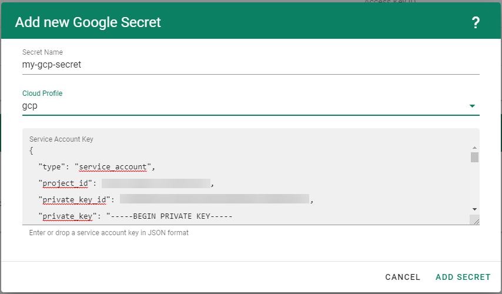
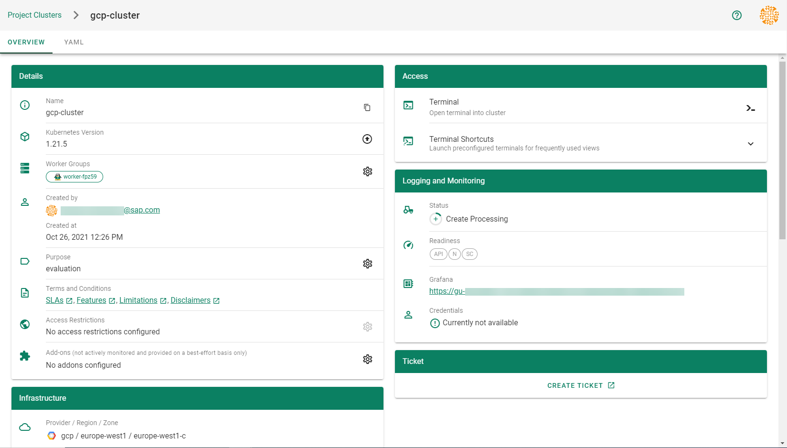

### Overview

Gardener allows you to create a Kubernetes cluster on different infrastructure providers. This tutorial will guide you through the process of creating a cluster on GCP.

### Prerequisites

- You have created a [GCP account](https://console.cloud.google.com/).
- You have access to the Gardener dashboard and have permissions to create projects.

### Steps

1. Go to the Gardener dashboard and create a *Project*.

    

1. Check which roles are required by Gardener.

    1. Choose *Secrets*, then the plus icon  and select *GCP*.

        

    1. Click on the help button .

        

        

1. Create a service account with the correct roles in GCP:
    1. [Create a new service account in GCP](https://console.cloud.google.com/iam-admin/serviceaccounts).

        

    1. Enter the name and description of your service account.

    1. Assign the roles required by Gardener.
    1. Choose *Done*.

        

4. Create a key for your service:

    1. Locate your service account, then choose *Actions* and *Manage keys*.

        

    1. Choose *Add Key*, then *Create new key*.

        

    1. Save the private key of the service account in JSON format.

        
        

        > Note: Save the key of the user, it’s used later to create secrets for Gardener.

1. Enable the [Google Compute API](https://console.developers.google.com/apis/library/compute.googleapis.com) by following [these steps](https://cloud.google.com/endpoints/docs/openapi/enable-api).
    > When you are finished, you should see the following page:
    
    

1. Enable the [Google IAM API](https://console.developers.google.com/apis/library/iam.googleapis.com) by following [these steps](https://cloud.google.com/endpoints/docs/openapi/enable-api).
    > When you are finished, you should see the following page:

    

1. On the Gardener dashboard, choose *Secrets* and then the plus sign . Select *GCP* from the drop down menu to add a new GCP secret.

1. Create your secret.

    1. Type the name of your secret.
    1. Select your *Cloud Profile*.
    1. Copy and paste the contents of the *.JSON* file you saved when you created the secret key on GCP.
    3. Choose *Add secret*.
    

    > After completing these steps, you should see your newly created secret in the *Infrastructure Secrets* section.

    

1. To create a new cluster, choose *Clusters* and then the plus sign in the upper right corner.

    

1. In the *Create Cluster* section:
    1. Select *GCP* in the *Infrastructure* tab.
    1. Type the name of your cluster in the *Cluster Details* tab.
    1. Choose the secret you created before in the *Infrastructure Details* tab.
    1. Choose *Create*.

    

1. Wait for your cluster to get created.

    

### Result

After completing the steps in this tutorial, you will be able to see and download the kubeconfig of your cluster.

  
