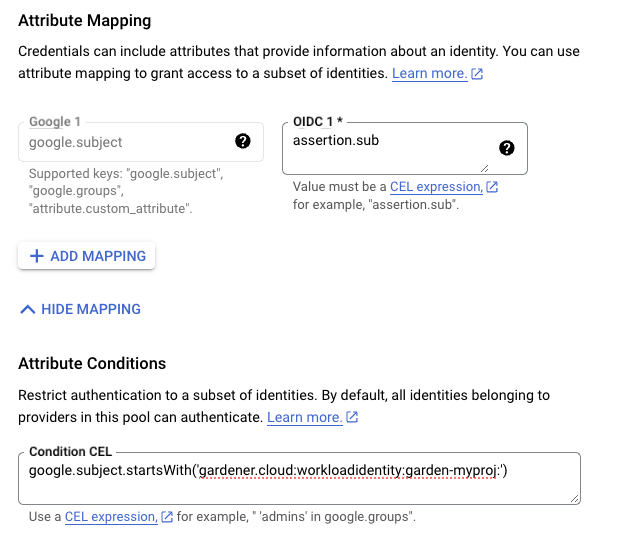

# Using the GCP provider extension with Gardener as end-user

The [`core.gardener.cloud/v1beta1.Shoot` resource](https://github.com/gardener/gardener/blob/master/example/90-shoot.yaml) declares a few fields that are meant to contain provider-specific configuration.

This document describes the configurable options for GCP and provides an example `Shoot` manifest with minimal configuration that can be used to create a GCP cluster (modulo the landscape-specific information like cloud profile names, secret binding names, etc.).

## Accessing GCP APIs

In order for Gardener to create a Kubernetes cluster using GCP infrastructure components, a Shoot has to provide an authentication mechanism giving sufficient permissions to the desired GCP project.
Every shoot cluster references a `SecretBinding` or a [`CredentialsBinding`](https://gardener.cloud/docs/gardener/api-reference/security/#security.gardener.cloud/v1alpha1.CredentialsBinding).

> [!IMPORTANT]
> While `SecretBinding`s can only reference `Secret`s, `CredentialsBinding`s can also reference `WorkloadIdentity`s which provide an alternative authentication method.
> `WorkloadIdentity`s do not directly contain credentials but are rather a representation of the workload that is going to access the user's account.
> If the user has configured [Workload Identity Federation](https://cloud.google.com/iam/docs/workload-identity-federation) with Gardener's Workload Identity Issuer then the GCP infrastructure components can access the user's account without the need of preliminary exchange of credentials.

> [!IMPORTANT]
> The `SecretBinding`/`CredentialsBinding` is configurable in the [Shoot cluster](https://github.com/gardener/gardener/blob/master/example/90-shoot.yaml) with the field `secretBindingName`/`credentialsBindingName`.
> `SecretBinding`s are considered legacy and will be deprecated in the future.
> It is advised to use `CredentialsBinding`s instead.

### GCP Service Account Credentials

The required credentials for the GCP project are a [Service Account Key](https://cloud.google.com/iam/docs/service-accounts#service_account_keys) to authenticate as a [GCP Service Account](https://cloud.google.com/compute/docs/access/service-accounts).
A service account is a special account that can be used by services and applications to interact with Google Cloud Platform APIs.
Applications can use service account credentials to authorize themselves to a set of APIs and perform actions within the permissions granted to the service account.

Make sure to [enable the Google Identity and Access Management (IAM) API](https://cloud.google.com/service-usage/docs/enable-disable).
[Create a Service Account](https://cloud.google.com/iam/docs/creating-managing-service-accounts) that shall be used for the Shoot cluster.
[Grant at least the following IAM roles](https://cloud.google.com/iam/docs/granting-changing-revoking-access) to the Service Account.
- Service Account Admin
- Service Account Token Creator
- Service Account User
- Compute Admin

Create a [JSON Service Account key](https://cloud.google.com/iam/docs/creating-managing-service-account-keys#creating_service_account_keys) for the Service Account.
Provide it in the `Secret` (base64 encoded for field `serviceaccount.json`), that is being referenced by the `SecretBinding` in the Shoot cluster configuration.

This `Secret` must look as follows:

```yaml
apiVersion: v1
kind: Secret
metadata:
  name: core-gcp
  namespace: garden-dev
type: Opaque
data:
  serviceaccount.json: base64(serviceaccount-json)
```

> [!WARNING]
> Depending on your API usage it can be problematic to reuse the same Service Account Key for different Shoot clusters due to rate limits.
> Please consider spreading your Shoots over multiple Service Accounts on different GCP projects if you are hitting those limits, see https://cloud.google.com/compute/docs/api-rate-limits.

### GCP Workload Identity Federation

Users can choose to trust Gardener's Workload Identity Issuer and eliminate the need for providing GCP Service Account credentials.

As a first step users should configure [Workload Identity Federation](https://cloud.google.com/iam/docs/workload-identity-federation-with-kubernetes#kubernetes) with Gardener's Workload Identity Issuer.

> [!TIP]
> You can retrieve Gardener's Workload Identity Issuer URL directly from the Garden cluster by reading the contents of the [Gardener Info ConfigMap](https://gardener.cloud/docs/gardener/gardener/gardener_info_configmap/).
>
> ```bash
> kubectl -n gardener-system-public get configmap gardener-info -o yaml
> ```

In the example attribute mapping shown below all `WorkloadIdentity`s that are created in the `garden-myproj` namespace will be authenticated.
Now that the Workload Identity Federation is configured the user should download the credential configuration file.

> [!IMPORTANT]
> If required, users can use a stricter mapping to authenticate only certain `WorkloadIdentity`s.
> Please, refer to the [attribute mappings documentation](https://cloud.google.com/iam/docs/workload-identity-federation#mapping) for more information.



Users should now create a Service Account that is going to be impersonated by the federated identity.
Make sure to [enable the Google Identity and Access Management (IAM) API](https://cloud.google.com/service-usage/docs/enable-disable).
[Create a Service Account](https://cloud.google.com/iam/docs/creating-managing-service-accounts) that shall be used for the Shoot cluster.
[Grant at least the following IAM roles](https://cloud.google.com/iam/docs/granting-changing-revoking-access) to the Service Account.
- Service Account Token Creator
- Service Account User
- Compute Admin

As a next step a resource of type `WorkloadIdentity` should be created in the Garden cluster and configured with the information from the already downloaded credential configuration file.
This identity will be used to impersonate the Service Account in order to call GCP APIs.

Mind that the `service_account_impersonation_url` is probably not present in the downloaded credential configuration file.
You can use the example template or download a new credential configuration file once we grant the permission to the federated identity to impersonate the Service Account.

A sample of such resource is shown below:

```yaml
apiVersion: security.gardener.cloud/v1alpha1
kind: WorkloadIdentity
metadata:
  name: gcp
  namespace: garden-myproj
spec:
  audiences:
  # This is the audience that you configure during workload identity pool creation
  - https://iam.googleapis.com/projects/<project_number>/locations/global/workloadIdentityPools/<pool_name>/providers/<provider_name>
  targetSystem:
    type: gcp
    providerConfig:
      apiVersion: gcp.provider.extensions.gardener.cloud/v1alpha1
      kind: WorkloadIdentityConfig
      projectID: gcp-project-name # This is the name of the project which the workload identity will access
      # Use the downloaded credential configuration file to set this field. The credential_source field is not important to Gardener and should be omitted.
      credentialsConfig:
        universe_domain: "googleapis.com"
        type: "external_account"
        audience: "//iam.googleapis.com/projects/<project_number>/locations/global/workloadIdentityPools/<pool_name>/providers/<provider_name>"
        subject_token_type: "urn:ietf:params:oauth:token-type:jwt"
        service_account_impersonation_url: "https://iamcredentials.googleapis.com/v1/projects/-/serviceAccounts/<service_account_email>:generateAccessToken"
        token_url: "https://sts.googleapis.com/v1/token"
```

Now users should give permissions to the `WorkloadIdentity` to impersonate the Service Account.
In order to construct the principal that will be used for impersonation retrieve the subject of the created `WorkloadIdentity`.
```bash
SUBJECT=$(kubectl -n garden-myproj get workloadidentity gcp -o=jsonpath='{.status.sub}')
echo "principal://iam.googleapis.com/projects/<project_number>/locations/global/workloadIdentityPools/<pool_name>/subject/$SUBJECT"
```
The principal template is also shown in the Google Console Workload Identity Pool UI.

Users should give this principal the Role `Workload Identity User` so that it can impersonate the Service Account.
One can do this through the Service Account `Permissions` tab, through the Google Console Workload Identity Pool UI or by using the [gcloud cli](https://cloud.google.com/iam/docs/workload-identity-federation-with-kubernetes#use-service-account-impersonation).


As a final step create a `CredentialsBinding` referencing the GCP `WorkloadIdentity` and use it in your `Shoot` definitions.

```yaml
apiVersion: security.gardener.cloud/v1alpha1
kind: CredentialsBinding
metadata:
  name: gcp
  namespace: garden-myproj
credentialsRef:
  apiVersion: security.gardener.cloud/v1alpha1
  kind: WorkloadIdentity
  name: gcp
  namespace: garden-myproj
provider:
  type: gcp
```

```yaml
apiVersion: core.gardener.cloud/v1beta1
kind: Shoot
metadata:
  name: gcp
  namespace: garden-myproj
spec:
  credentialsBindingName: gcp
  ...
```

> [!WARNING]
> One can omit the creation of Service Account and directly grant access to the federated identity's principal, skipping the Service Account impersonation.
> This although recommended, will not always work because federated identities do not fall under the [`allAuthenticatedUsers`](https://cloud.google.com/iam/docs/principals-overview#all-authenticated-users) category and cannot access machine images that are not made available to [`allUsers`](https://cloud.google.com/iam/docs/principals-overview#all-users).
> This means that machine images should be made available to `allUsers` or permissions should be explicitly given to the federated identity in order for this to work.
>
> GCP imposes some restrictions on which images can be accessible to `allUsers`. 
> As of now, [Gardenlinux](https://github.com/gardenlinux/gardenlinux) images are not published in a way that they can be accessed by `allUsers`.
> See the following issue for more details https://github.com/gardenlinux/glci/issues/148.

## `InfrastructureConfig`

The infrastructure configuration mainly describes how the network layout looks like in order to create the shoot worker nodes in a later step, thus, prepares everything relevant to create VMs, load balancers, volumes, etc.

An example `InfrastructureConfig` for the GCP extension looks as follows:

```yaml
apiVersion: gcp.provider.extensions.gardener.cloud/v1alpha1
kind: InfrastructureConfig
networks:
# vpc:
#   name: my-vpc
#   cloudRouter:
#     name: my-cloudrouter
  workers: 10.250.0.0/16
# internal: 10.251.0.0/16
# cloudNAT:
#   minPortsPerVM: 2048
#   maxPortsPerVM: 65536
#   endpointIndependentMapping:
#     enabled: false
#   enableDynamicPortAllocation: false
#   natIPNames:
#   - name: manualnat1
#   - name: manualnat2
#   udpIdleTimeoutSec: 30
#   icmpIdleTimeoutSec: 30
#   tcpEstablishedIdleTimeoutSec: 1200
#   tcpTransitoryIdleTimeoutSec: 30
#   tcpTimeWaitTimeoutSec: 120
# flowLogs:
#   aggregationInterval: INTERVAL_5_SEC
#   flowSampling: 0.2
#   metadata: INCLUDE_ALL_METADATA
```

The `networks.vpc` section describes whether you want to create the shoot cluster in an already existing VPC or whether to create a new one:

* If `networks.vpc.name` is given then you have to specify the VPC name of the existing VPC that was created by other means (manually, other tooling, ...).
If you want to get a fresh VPC for the shoot then just omit the `networks.vpc` field.

* If a VPC name is not given then we will create the cloud router + NAT gateway to ensure that worker nodes don't get external IPs.

* If a VPC name is given then a cloud router name must also be given, failure to do so would result in validation errors
and possibly clusters without egress connectivity.

* If a VPC name is given and calico shoot clusters are created without a network overlay within one VPC make sure that the pod CIDR specified in `shoot.spec.networking.pods` is not overlapping with any other pod CIDR used in that VPC.
Overlapping pod CIDRs will lead to disfunctional shoot clusters.

The `networks.workers` section describes the CIDR for a subnet that is used for all shoot worker nodes, i.e., VMs which later run your applications.

The `networks.internal` section is optional and can describe a CIDR for a subnet that is used for [internal load balancers](https://cloud.google.com/load-balancing/docs/internal/),

The `networks.cloudNAT.minPortsPerVM` is optional and is used to define the [minimum number of ports allocated to a VM for the CloudNAT](https://cloud.google.com/nat/docs/overview#number_of_nat_ports_and_connections)

The `networks.cloudNAT.natIPNames` is optional and is used to specify the names of the manual ip addresses which should be used by the nat gateway

The `networks.cloudNAT.endpointIndependentMapping` is optional and is used to define the [endpoint mapping behavior](https://cloud.google.com/nat/docs/ports-and-addresses#ports-reuse-endpoints). You can enable it or disable it at any point by toggling `networks.cloudNAT.endpointIndependentMapping.enabled`. By default, it is disabled.

`networks.cloudNAT.enableDynamicPortAllocation` is optional (default: `false`) and allows one to enable dynamic port allocation (https://cloud.google.com/nat/docs/ports-and-addresses#dynamic-port). Note that enabling this puts additional restrictions on the permitted values for `networks.cloudNAT.minPortsPerVM` and `networks.cloudNAT.minPortsPerVM`, namely that they now both are required to be powers of two. Also, `maxPortsPerVM` may not be given if dynamic port allocation is _disabled_.

`networks.cloudNAT.udpIdleTimeoutSec`, `networks.cloudNAT.icmpIdleTimeoutSec`, `networks.cloudNAT.tcpEstablishedIdleTimeoutSec`, `networks.cloudNAT.tcpTransitoryIdleTimeoutSec`, and `networks.cloudNAT.tcpTimeWaitTimeoutSec` give more fine-granular control over various timeout-values. For more details see https://cloud.google.com/nat/docs/public-nat#specs-timeouts.

The specified CIDR ranges must be contained in the VPC CIDR specified above, or the VPC CIDR of your already existing VPC.
You can freely choose these CIDRs and it is your responsibility to properly design the network layout to suit your needs.

The `networks.flowLogs` section describes the configuration for the VPC flow logs. In order to enable the VPC flow logs at least one of the following parameters needs to be specified in the flow log section:

* `networks.flowLogs.aggregationInterval` an optional parameter describing the aggregation interval for collecting flow logs. For more details, see [aggregation_interval reference](https://www.terraform.io/docs/providers/google/r/compute_subnetwork.html#aggregation_interval).

* `networks.flowLogs.flowSampling` an optional parameter describing the sampling rate of VPC flow logs within the subnetwork where 1.0 means all collected logs are reported and 0.0 means no logs are reported. For more details, see [flow_sampling reference](https://www.terraform.io/docs/providers/google/r/compute_subnetwork.html#flow_sampling).

* `networks.flowLogs.metadata` an optional parameter describing whether metadata fields should be added to the reported VPC flow logs. For more details, see [metadata reference](https://www.terraform.io/docs/providers/google/r/compute_subnetwork.html#metadata).

Apart from the VPC and the subnets the GCP extension will also create a dedicated service account for this shoot, and firewall rules.

## `ControlPlaneConfig`

The control plane configuration mainly contains values for the GCP-specific control plane components.
Today, the only component deployed by the GCP extension is the `cloud-controller-manager`.

An example `ControlPlaneConfig` for the GCP extension looks as follows:

```yaml
apiVersion: gcp.provider.extensions.gardener.cloud/v1alpha1
kind: ControlPlaneConfig
zone: europe-west1-b
cloudControllerManager:
# featureGates:
#   SomeKubernetesFeature: true
storage:
  managedDefaultStorageClass: true
  managedDefaultVolumeSnapshotClass: true
#  csiFilestore:
#    enabled: true
```

The `zone` field tells the cloud-controller-manager in which zone it should mainly operate.
You can still create clusters in multiple availability zones, however, the cloud-controller-manager requires one "main" zone.
:warning: You always have to specify this field!

The `cloudControllerManager.featureGates` contains a map of explicitly enabled or disabled feature gates.
For production usage it's not recommend to use this field at all as you can enable alpha features or disable beta/stable features, potentially impacting the cluster stability.
If you don't want to configure anything for the `cloudControllerManager` simply omit the key in the YAML specification.

The members of the `storage` allows to configure the provided storage classes further.
If `storage.managedDefaultStorageClass` is enabled (the default), the `default` StorageClass deployed will be marked as default (via `storageclass.kubernetes.io/is-default-class` annotation).
Similarly, if `storage.managedDefaultVolumeSnapshotClass` is enabled (the default), the `default` VolumeSnapshotClass deployed will be marked as default.
In case you want to set a different StorageClass or VolumeSnapshotClass as default you need to set the corresponding option to `false` as at most one class should be marked as default in each case and the ResourceManager will prevent any changes from the Gardener managed classes to take effect.

Furthermore, the `storage.csiFilestore.enabled` field can be set to `true` to 
enable the [GCP Filestore CSI driver](https://cloud.google.com/filestore/docs/csi-driver).
Additionally, you have to make sure that your IAM user has the permission `roles/file.editor` and
that the filestore API is enabled in your GCP project.

## WorkerConfig

The worker configuration contains:

* Local SSD interface for the additional volumes attached to GCP worker machines.

  If you attach the disk with `SCRATCH` type, either an `NVMe` interface or a `SCSI` interface must be specified.
  It is only meaningful to provide this volume interface if only `SCRATCH` data volumes are used.

* Volume Encryption config that specifies values for `kmsKeyName` and `kmsKeyServiceAccountName`.
  * The `kmsKeyName` is the
  key name of the cloud kms disk encryption key and must be specified if CMEK disk encryption is needed.
  *  The `kmsKeyServiceAccount` is the service account granted the `roles/cloudkms.cryptoKeyEncrypterDecrypter` on the `kmsKeyName`
  If empty, then the role should be given to the Compute Engine Service Agent Account. This CESA account usually has the name:
   `service-PROJECT_NUMBER@compute-system.iam.gserviceaccount.com`. See: https://cloud.google.com/iam/docs/service-agents#compute-engine-service-agent
  * Prior to use, the operator should add IAM policy binding using the gcloud CLI:
    ```
    gcloud projects add-iam-policy-binding projectId --member
    serviceAccount:name@projectIdgserviceaccount.com --role roles/cloudkms.cryptoKeyEncrypterDecrypter
    ```
  * Setting `.spec.provider.workers[].(data)Volumes[].encrypted` has no impact because GCP disks are encrypted by default. 

* Setting a volume image with `dataVolumes.sourceImage`.
  However, this parameter should only be used with particular caution.
  For example Gardenlinux works with filesystem LABELs only and creating another disk form the very same image causes the LABELs to be duplicated.
  See: https://github.com/gardener/gardener-extension-provider-gcp/issues/323

* Some hyperdisks allow adjustment of their default values for `provisionedIops` and `provisionedThroughput`.
  Keep in mind though that Hyperdisk Extreme and Hyperdisk Throughput volumes can't be used as boot disks.

* Service Account with their specified scopes, authorized for this worker.

  Service accounts created in advance that generate access tokens that can be accessed through the metadata server and used to authenticate applications on the instance.

  **Note**: If you do not provide service accounts for your workers, the Compute Engine default service account will be used. For more details on the default account, see https://cloud.google.com/compute/docs/access/service-accounts#default_service_account.
  If the `DisableGardenerServiceAccountCreation` feature gate is disabled, Gardener will create a shared service accounts to use for all instances. This feature gate is currently in beta and it will no longer be possible to re-enable the service account creation via feature gate flag.

* GPU with its type and count per node. This will attach that GPU to all the machines in the worker grp

  **Note**:
  * A rolling upgrade of the worker group would be triggered in case the `acceleratorType` or `count` is updated.
  * Some machineTypes like [a2 family](https://cloud.google.com/blog/products/compute/announcing-google-cloud-a2-vm-family-based-on-nvidia-a100-gpu) come with already attached gpu of `a100` type and pre-defined count. If your workerPool consists of such machineTypes, please specify exact GPU configuration for the machine type as specified in Google cloud documentation.  `acceleratorType` to use for families with attached gpu are stated below:
    1) *a2 family* -> `nvidia-tesla-a100`
    2) *g2 family* -> `nvidia-l4`

  * Sufficient quota of gpu is needed in the GCP project. This includes quota to support autoscaling if enabled.
  * GPU-attached machines can't be live migrated during host maintenance events. Find out how to handle that in your application [here](https://cloud.google.com/compute/docs/gpus/gpu-host-maintenance)
  * GPU count specified here is considered for forming node template during scale-from-zero in Cluster Autoscaler

* The `.nodeTemplate` is used to specify resource information of the machine during runtime. This then helps in Scale-from-Zero.
    Some points to note for this field:
    - Currently only cpu, gpu and memory are configurable.
    - a change in the value lead to a rolling update of the machine in the workerpool
    - all the resources needs to be specified

  An example `WorkerConfig` for the GCP looks as follows:
```yaml
apiVersion: gcp.provider.extensions.gardener.cloud/v1alpha1
kind: WorkerConfig
volume:
  interface: NVME
  encryption:
    kmsKeyName: "projects/projectId/locations/<zoneName>/keyRings/<keyRingName>/cryptoKeys/alpha"
    kmsKeyServiceAccount: "user@projectId.iam.gserviceaccount.com"
dataVolumes:
  - name: test
    sourceImage: projects/sap-se-gcp-gardenlinux/global/images/gardenlinux-gcp-gardener-prod-amd64-1443-3-c261f887
    provisionedIops: 3000
    provisionedThroughput: 140
serviceAccount:
  email: foo@bar.com
  scopes:
  - https://www.googleapis.com/auth/cloud-platform
gpu:
  acceleratorType: nvidia-tesla-t4
  count: 1
nodeTemplate: # (to be specified only if the node capacity would be different from cloudprofile info during runtime)
  capacity:
    cpu: 2
    gpu: 1
    memory: 50Gi
```
## Example `Shoot` manifest

Please find below an example `Shoot` manifest:

```yaml
apiVersion: core.gardener.cloud/v1beta1
kind: Shoot
metadata:
  name: johndoe-gcp
  namespace: garden-dev
spec:
  cloudProfile:
    name: gcp
  region: europe-west1
  credentialsBindingName: core-gcp
  provider:
    type: gcp
    infrastructureConfig:
      apiVersion: gcp.provider.extensions.gardener.cloud/v1alpha1
      kind: InfrastructureConfig
      networks:
        workers: 10.250.0.0/16
    controlPlaneConfig:
      apiVersion: gcp.provider.extensions.gardener.cloud/v1alpha1
      kind: ControlPlaneConfig
      zone: europe-west1-b
    workers:
    - name: worker-xoluy
      machine:
        type: n1-standard-4
      minimum: 2
      maximum: 2
      volume:
        size: 50Gi
        type: pd-standard
      zones:
      - europe-west1-b
  networking:
    nodes: 10.250.0.0/16
    type: calico
  kubernetes:
    version: 1.33.3
  maintenance:
    autoUpdate:
      kubernetesVersion: true
      machineImageVersion: true
  addons:
    kubernetesDashboard:
      enabled: true
    nginxIngress:
      enabled: true
```

## CSI volume provisioners

Every GCP shoot cluster will be deployed with the GCP PD CSI driver.
It is compatible with the legacy in-tree volume provisioner that was deprecated by the Kubernetes community and will be removed in future versions of Kubernetes.
End-users might want to update their custom `StorageClass`es to the new `pd.csi.storage.gke.io` provisioner.

## Support for VolumeAttributesClasses (Beta in k8s 1.31)

To have the CSI-driver configured to support the necessary features for [VolumeAttributesClasses](https://kubernetes.io/docs/concepts/storage/volume-attributes-classes/) on GCP for shoots with a k8s-version greater than 1.31, use the `gcp.provider.extensions.gardener.cloud/enable-volume-attributes-class` annotation on the shoot. Keep in mind to also enable the required feature flags and runtime-config on the common kubernetes controllers (as outlined in the link above) in the shoot-spec.

## Kubernetes Versions per Worker Pool

This extension supports `gardener/gardener`'s `WorkerPoolKubernetesVersion` feature gate, i.e., having [worker pools with overridden Kubernetes versions](https://github.com/gardener/gardener/blob/8a9c88866ec5fce59b5acf57d4227eeeb73669d7/example/90-shoot.yaml#L69-L70) since `gardener-extension-provider-gcp@v1.21`.

## Shoot CA Certificate and `ServiceAccount` Signing Key Rotation

This extension supports `gardener/gardener`'s `ShootCARotation` and `ShootSARotation` feature gates since `gardener-extension-provider-gcp@v1.23`.

## BackupBucket

Gardener manages `etcd` backups for Shoot clusters using provider-specific backup storage solutions. On GCP, this storage is implemented through [Google Cloud Storage (GCS) buckets](https://cloud.google.com/storage/docs/buckets#buckets), which store snapshots of the cluster’s `etcd` data.

The `BackupBucket` resource abstracts the backup infrastructure, enabling Gardener and its extension controllers to manage it seamlessly. This abstraction allows Gardener to create, delete, and maintain backup buckets across various cloud providers in a standardized manner.

The `BackupBucket` resource includes a `spec` field, which defines the configuration details for the backup bucket. These details include:

- The region where the bucket should be created.
- A reference to the secret containing credentials for accessing the cloud provider.
- A `ProviderConfig` field for provider-specific configurations.

### BackupBucketConfig

The `BackupBucketConfig` represents the configuration for a backup bucket. It includes an optional immutability configuration that enforces retention policies on the backup bucket.

The Gardener extension provider for GCP supports creating and managing immutable backup buckets by leveraging the [bucket lock](https://cloud.google.com/storage/docs/bucket-lock) feature. Immutability ensures that once data is written to the bucket, it cannot be modified or deleted for a specified period. This feature is crucial for protecting backups from accidental or malicious deletion, ensuring data safety and availability for restoration.

Here is an example configuration for `BackupBucketConfig`:

```yaml
apiVersion: gcp.provider.extensions.gardener.cloud/v1alpha1
kind: BackupBucketConfig
immutability:
  retentionType: bucket
  retentionPeriod: "24h"
  locked: false
```

- **`retentionType`**: Specifies the type of retention policy. The allowed value is `bucket`, which applies the retention policy to the entire bucket. For more details, refer to the [documentation](https://cloud.google.com/storage/docs/bucket-lock). 
- **`retentionPeriod`**: Defines the duration for which objects in the bucket will remain immutable. The value should follow GCP-supported formats, such as `"24h"` for 24 hours. Refer to [retention period formats](https://cloud.google.com/storage/docs/bucket-lock#retention-periods) for more information. The minimum retention period is **24 hours**.
- **`locked`**: A boolean indicating whether the retention policy is locked. Once locked, the policy cannot be removed or shortened, ensuring immutability. Learn more about locking policies [here](https://cloud.google.com/storage/docs/bucket-lock#policy-locks).

To configure a `BackupBucket` with immutability, include the `BackupBucketConfig` in the `ProviderConfig` of the `BackupBucket` resource. If the `locked` field is set to `true`, the retention policy will be locked, preventing the retention policy from being removed and the retention period from being reduced. However, it's still possible to increase the retention period.

Here is an example of configuring a `BackupBucket` with immutability:

```yaml
apiVersion: extensions.gardener.cloud/v1alpha1
kind: BackupBucket
metadata:
  name: my-backup-bucket
spec:
  provider:
    region: europe-west1
  secretRef:
    name: my-gcp-secret
    namespace: my-namespace
  providerConfig:
    apiVersion: gcp.provider.extensions.gardener.cloud/v1alpha1
    kind: BackupBucketConfig
    immutability:
      retentionType: bucket
      retentionPeriod: 24h
      locked: true
```
